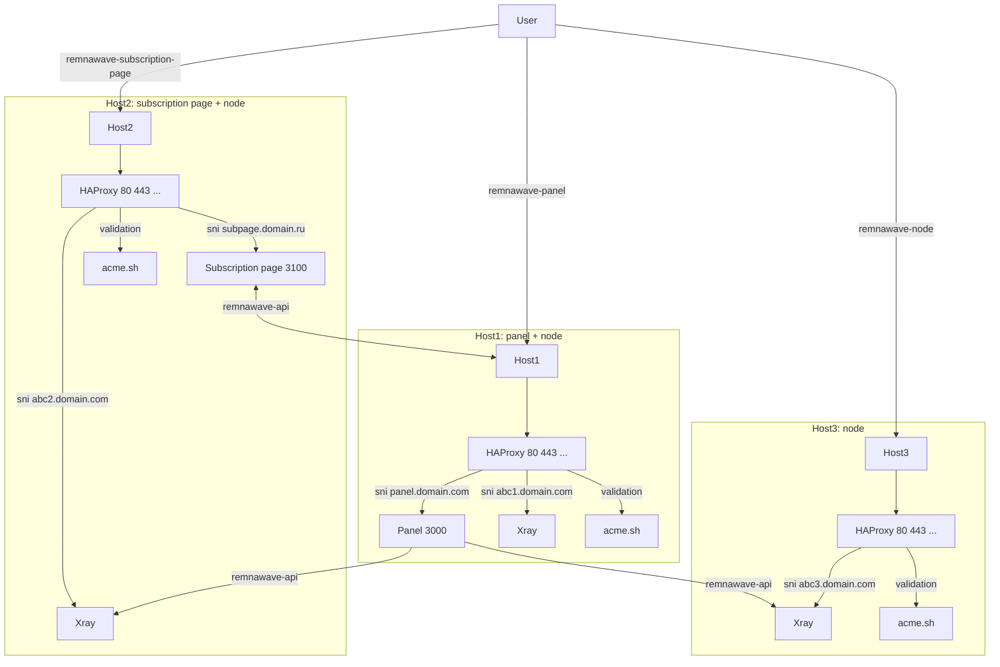

# Remnawave Ansible

Набор Ansible плейбуков для развертывания и управления инфраструктурой Remnawave.

## Документация Inventory

Описание структуры инвентаря, групп хостов и доступных переменных находится в файле [inventory/README.md](inventory/README.md).

## Применение

### Remnawave Panel

```sh
ansible-playbook -i inventory/hosts_to_prepare.yml playbook_system_prepare.yml --limit panel
```

```sh
ansible-playbook playbook_remnawave_panel.yml --limit panel
```

## Remnawave Node

```sh
ansible-playbook -i inventory/hosts_to_prepare.yml playbook_system_prepare.yml --limit node-msk-01
```

```sh
ansible-playbook playbook_remnawave_nodes.yml
```

## Remnawave Subscription Page

Входит в состав плейбука узла:

```sh
ansible-playbook playbook_remnawave_nodes.yml --limit node
```

## Remnawave Api - Поиск доменов по имени узла

```sh
ansible-playbook playbooks/remnawave_sni_map.yml --limit node-msk-01
```

## acme.sh

```sh
ansible-playbook playbooks/remnawave_sni_map.yml playbooks/acme.yml
```

## Iptables

```sh
ansible-playbook playbooks/system_iptables.yml --limit node-msk-01
```

## Тесты

Пинг:

```sh
ansible edge-kz-01 -e "ansible_port=22" -u root --ask-pass -m ping
```

Проверка синтаксиса:

```sh
ansible-playbook playbook_remnawave_panel.yml --syntax-check
```

## Архитектура



---

_"remnawave_sni_map" и "remnawave_inbounds_cache" взяты из проекта [vff-remnawave-auto](https://github.com/ryabkov82/vff-remnawave-auto)._
